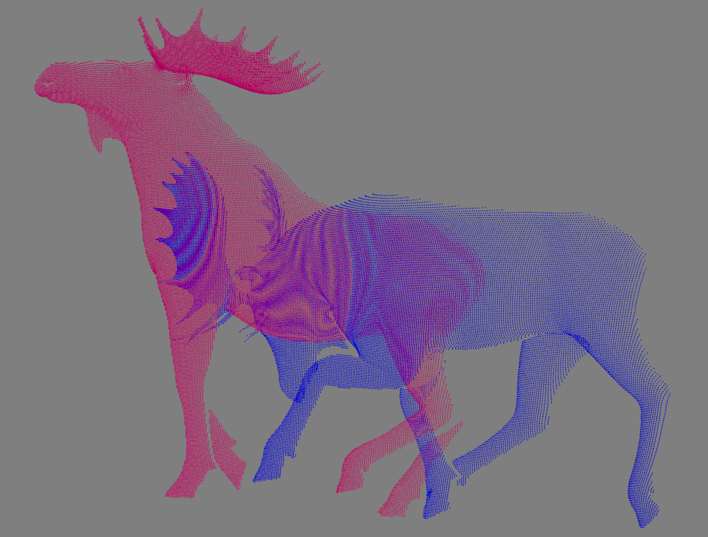
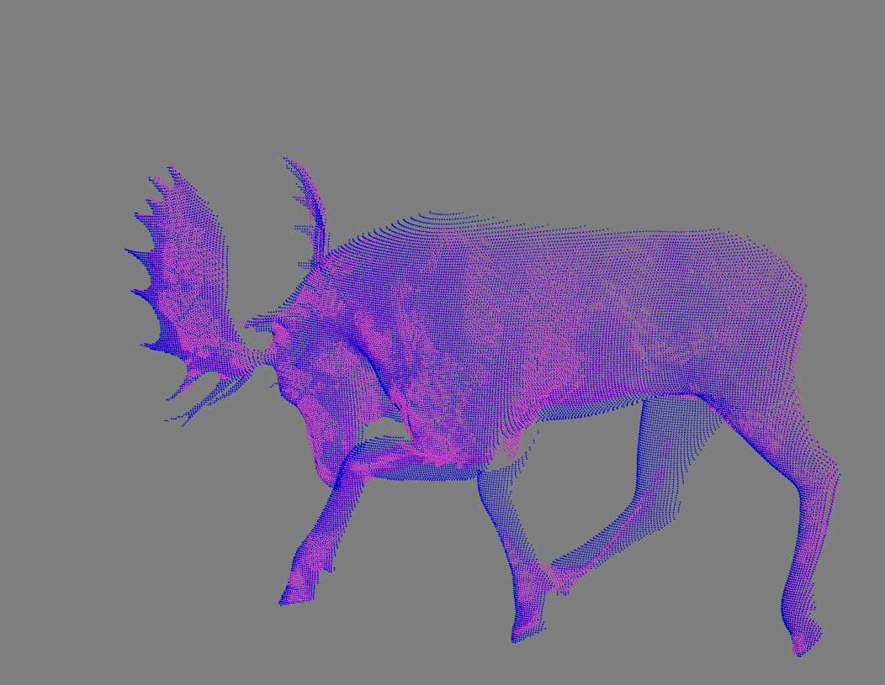

#### Requirements
- Pytorch (tested on 1.9.0)
- Pytorch3D
- [lietorch](https://github.com/princeton-vl/lietorch)
- Mayavi & open3D for visualization

#### install
```shell
cd cxx
python setup.py install
```

Run on the moose example, leveraging the sparse landmark correspondences predicted by [Leaprd](https://github.com/rabbityl/lepard)
```shell
python main.py config.yaml
```
Config the ```w_ldmk``` to ```0``` to get results of the vanilla N-ICP.


Point clouds before and after registration

<br> 



